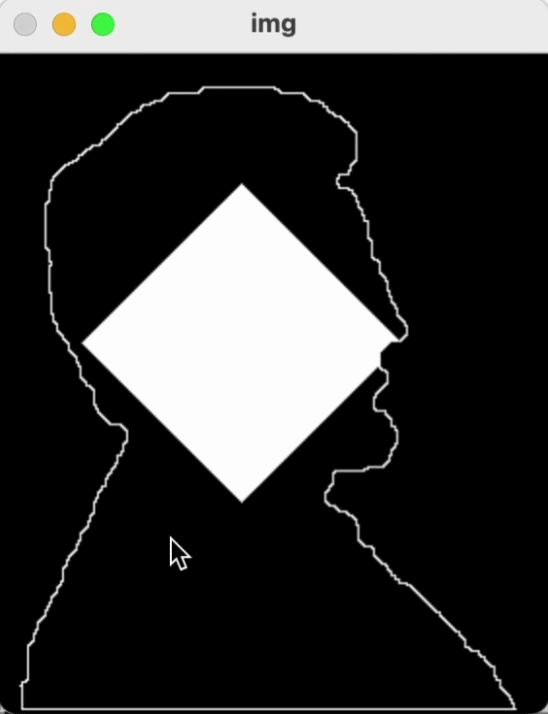

# Boundary and Fillings
morpological operation을 이용해서 boundary를 계산하고, region filling을 구현.

## 구현 순서 및 설명
1. 입력 영상을 gray scale로 입력 받음.
2. morpological operation을 이용하여 boundary를 계산하여 화면에 표시.
3. boundary 영상 내부 (또는 외부)를 click하면 morpological operation을 이용하여 region filling을 진행 (이때, 각 시작점은 마우스 입력을 통하여 입력 받음.)
4. region filling의 각 단게를 imshow를 통하여 보여줌.

## Demo
 