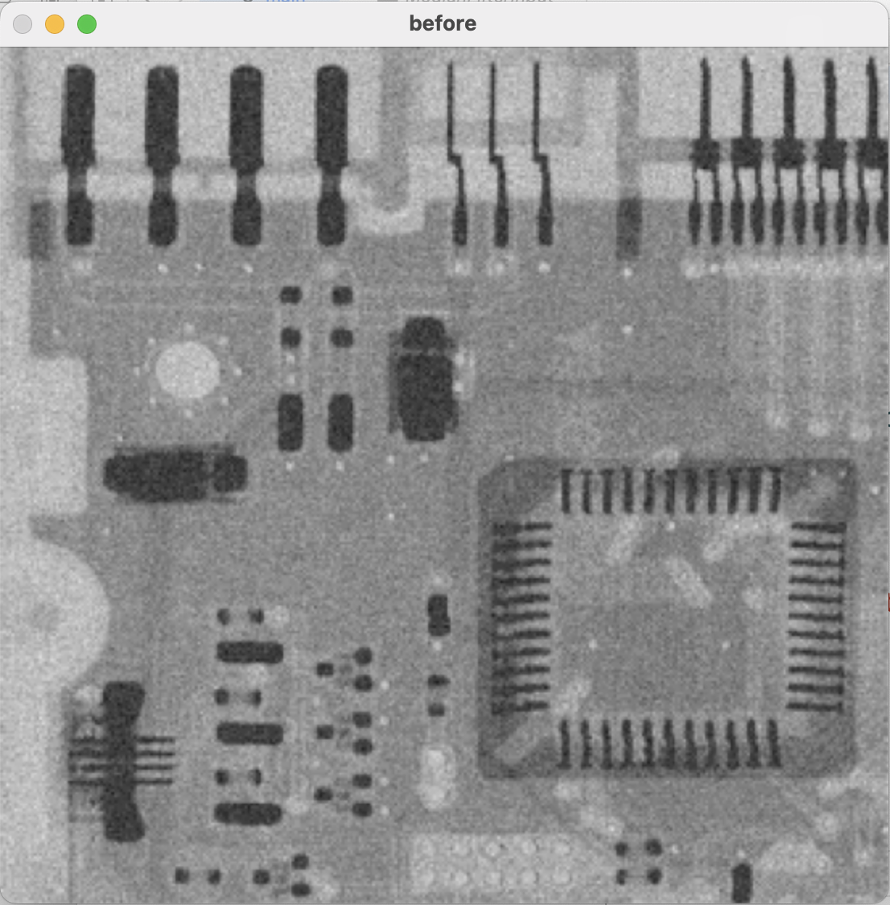
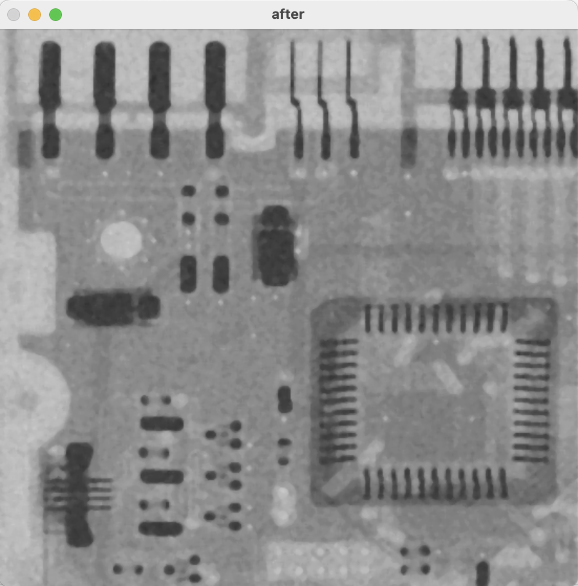

# Median Filtering
Median Filtering 구현.  

## 코드 Flow
1. 영상을 imread 함수를 이용해서 흑백으로 읽음.
2. median filtering 함수 구현
3. 함수의 결과 영상을 imshow를 이용해서 출력.

## median filter 함수 명세
```C++
MedianFilter(inputArray input, OutputArray output, int windowSize);
```

```plaintext
1. 상, 하, 좌, 우의 범위를 계산. 범위*2 + 1 = windowSize
2. 입력 영상과 같은 크기의 결과 image 생성.
3. 결과 image의 모든 픽셀에 대해서 입력 영상의 해당 픽셀 및 주변의 범위에 해당하는 픽셀의 밝기 값들을 배열에 모음. (padding 적용)
4. 범위 내의 픽셀들의 밝기 값들을 정렬
5. 정렬 된 밝기 중 가운데 값을 찾아서 결과 영상의 해당 픽셀에 대입
```

## Results(Before & After)

<p align="center">
  
  
</p>